# Installing Rust on Windows

This guide will cover:
  - [Installing Rust with Rustup](#installing-rust-with-rustup)
  - [Configuring GVim 8.x for Rust](#configuring-gvim-8x-for-rust-with-the-rls)
  - [Configuring VS Code for Rust](#configuring-vs-code-for-rust-with-the-rls)

## Installing Rust with Rustup

1. Visit [rustup.rs](https://rustup.rs), download, and then run rustup-init.exe

    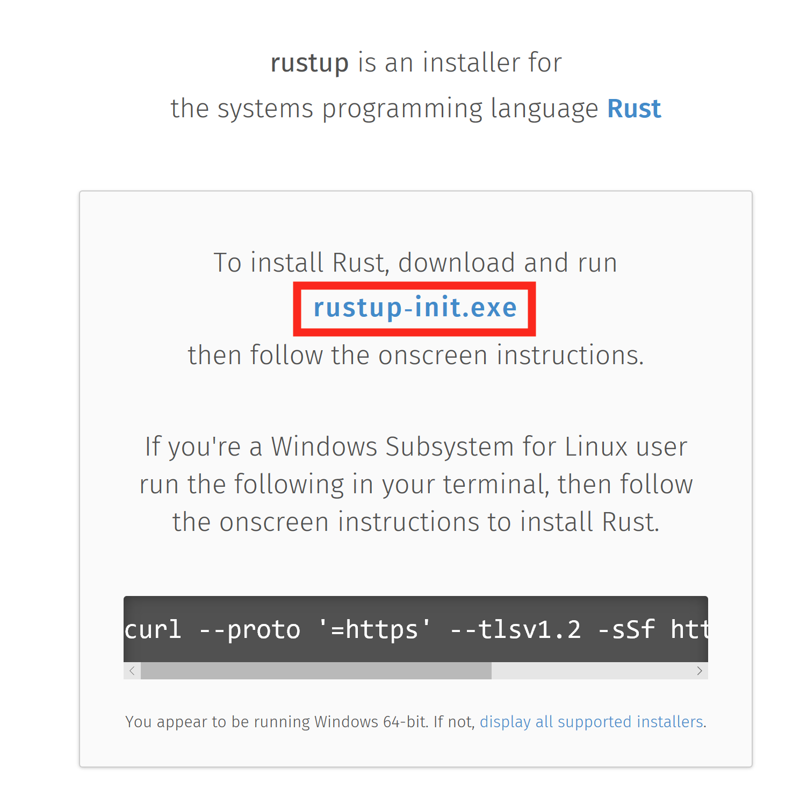

2. Make sure you have the dependencies met. The Rust installation includes the Rust compiler, but Rust uses the system linker to create the final executables and link to system shared libraries (DLLs). So, we have to make sure a usable linker and system libraries are installed.
   1. If you already have one of the listed Visual Studio versions installed with C++ build tools, the dependencies should be met already
      1. If later you get an error about "Link.exe", follow step 2
   2. Otherwise, install these:
      1. [Windows 10 SDK](https://developer.microsoft.com/en-us/windows/downloads/windows-10-sdk)
      2. [Microsoft Visual C++ build tools](https://www.google.com/url?sa=t&rct=j&q=&esrc=s&source=web&cd=1&cad=rja&uact=8&ved=2ahUKEwj647KSzY_kAhXCPn0KHV5nC4IQFjAAegQIAhAB&url=https%3A%2F%2Fgo.microsoft.com%2Ffwlink%2F%3FLinkId%3D691126&usg=AOvVaw0geDw_h-TSCfzTMvYE2ZOw)

    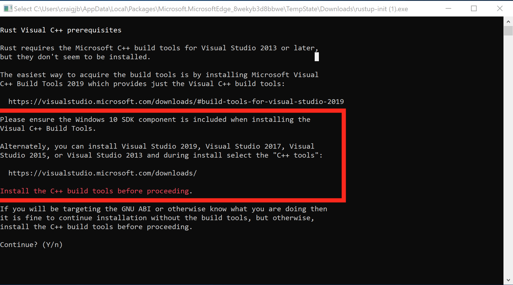

3. Press `1` and then `enter` to proceed with the installation

    

4. Once the installation is complete, the below message should show. Press `enter` to close the window.

    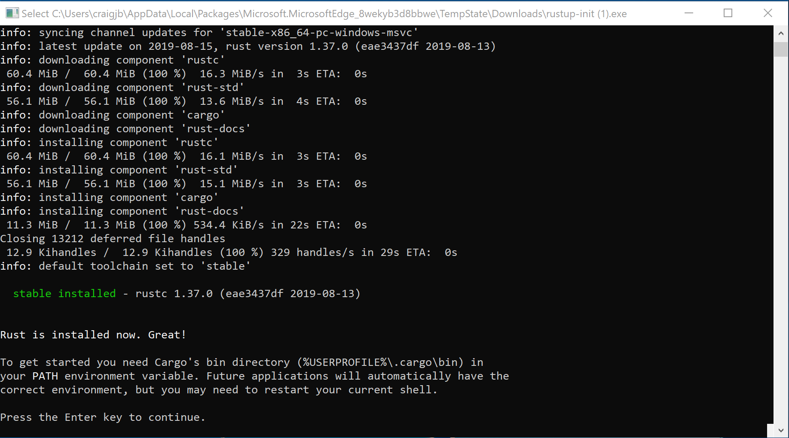

5. Test the rustup installation:
   1. Open a new command prompt window
   2. Run the command `rustup`. The command should show help information.

    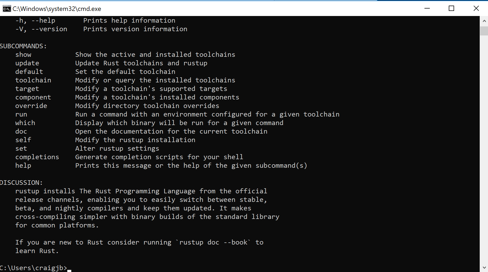

   3. If the `rustup` command fails, add `%USERPROFILE%\.cargo\bin` to your `PATH` environment variable.

6. Install the Rust Language Server (RLS):
   1. Open a command prompt window (you can reuse the same window)
   2. Run the command `rustup component add rls`. The command should download and install the RLS.

    

   3. Install the rustfmt component by running the command `rustup component add rustfmt`
   
    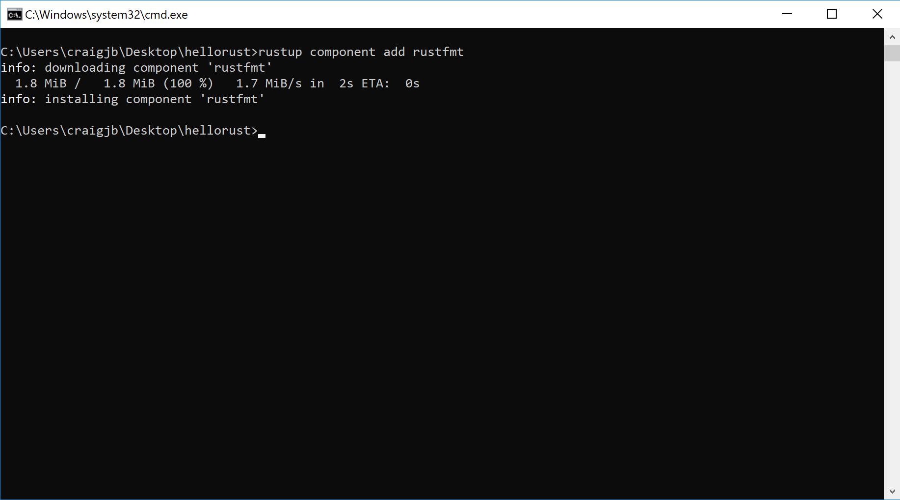

## Test out the Rust installation

1. Open a command prompt window
2. Navigate to a directory wherein we will create a test project.
3. Run the command `cargo new --bin hellorust` to create a new project named "hellorust".
   - Cargo is the Rust build system and package manager.
   - The `--bin` argument means we are creating a binary project that builds an executable.
   - We can also create a crate (Rust's name for libraries) by passing the `--lib` argument.
   - The `cargo new` command creates a new directory named "hellorust" and creates the default Rust project directory structure

    ```text
    hellorust
    - src
      - main.rs
    - Cargo.toml
    - Cargo.lock
    - target
    ```

    - The `src` directory contains the project's Rust source code files
    - `Cargo.toml` contains the project configuration used by Cargo to build the project. This file includes dependencies, build configurations, metadata, and more.
    - `Cargo.lock` is generated by Cargo and contains the "locked" or exact versions of the dependencies used to build your project. This file should not be edited.
    - The `target` directory contains the build products generate by Cargo. For a binary project, the exectuable will usually be at `target\debug\hellorust` (or `target\release\hellorust`).

4. Navigate into the "hellorust" directory
5. Build the project by running the command `cargo build`
    - By default, Cargo will build the project in the debug configuration
    - You can build the release configuration with the command: `cargo build --release`
    - If you see an error about "Link.exe", make sure the installation dependencies are met (detailed in the installation section above)

    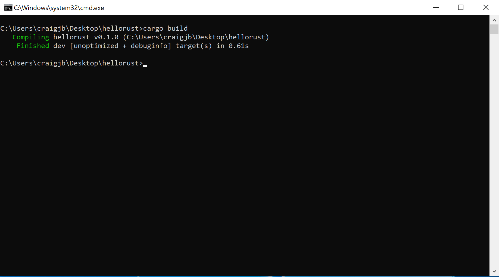

6. Run the project with the command: `cargo run`
    - This command will also build the project if your build is out-of-date
    - By default, `cargo run` builds and runs the debug configuration. You can run the release configuration with: `cargo run --release`.
    - Arguments after `cargo run` are passed to Cargo (for example the `--release` argument). If you want to pass arguments to your program, put them after a `--` delimiter. For example: `cargo run --release -- my args here`

    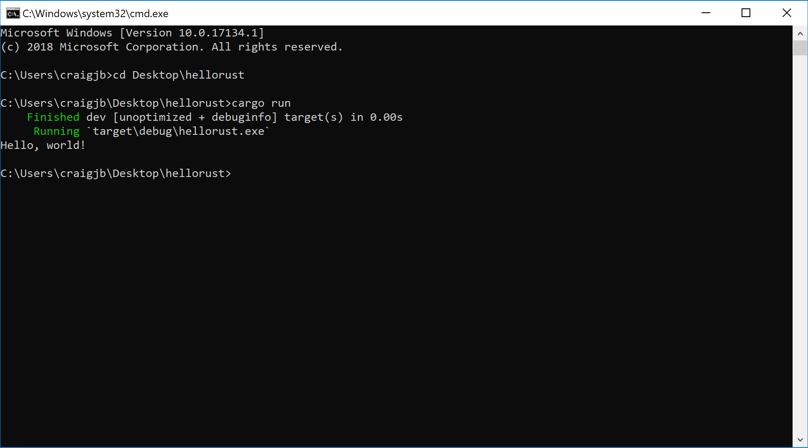

7. Many Rust projects include automated tests. Cargo can run these tests with the command `cargo test` (`--release` works here too). To try out Rust tests, we can modify `src/main.rs` to contain a simple failing test:
   1. Modify `main.rs`:
   ```rust
   fn main() {
       println!("Hello, world!");
   }

   #[test]
   fn failing_test() {
       assert!(2 + 2 == 5);
   }
   ```
   1. Run the tests with `cargo test`

    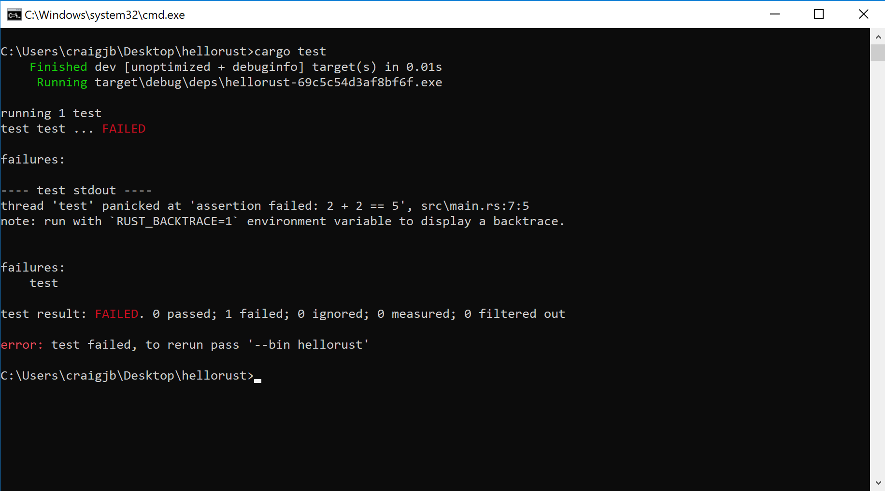

## Configuring GVim 8.x for Rust with the RLS
The steps below configure GVim 8.x on Windows to support Rust and use the Rust Language Server (RLS) for autocompletion.

1. Make sure you have a working Git installation. ([Download Here for Windows](https://git-scm.com/download/win))
2. Visit [https://rls.booyaa.wtf](https://rls.booyaa.wtf) and follow the steps for your preferred Vim package management strategy.
3. Modify your vimrc to include the below snippet. The guide linked in the previous step is still configured to use the Rust nightly build, since the RLS used to only be available in the nightly builds. RLS is now available in stable, and we installed stable Rust (the default). The below snippet should replace the one from the linked guide, and changes the 'cmd' to use stable instead of nightly.
   
   ```text
    if executable('rls')
        au User lsp_setup call lsp#register_server({
            \ 'name': 'rls',
            \ 'cmd': {server_info->['rustup', 'run', 'stable', 'rls']},
            \ 'whitelist': ['rust'],
            \ })
    endif
   ```
4. Make sure `filetype plugin indent on` and `syntax enable` and lets add format on save as well like `let g:rustfmt_autosave = 1`
5. Restart GVim or reload your vimrc
6. Open a Rust file and test our autocompletion (for example start typing `use std::`)

    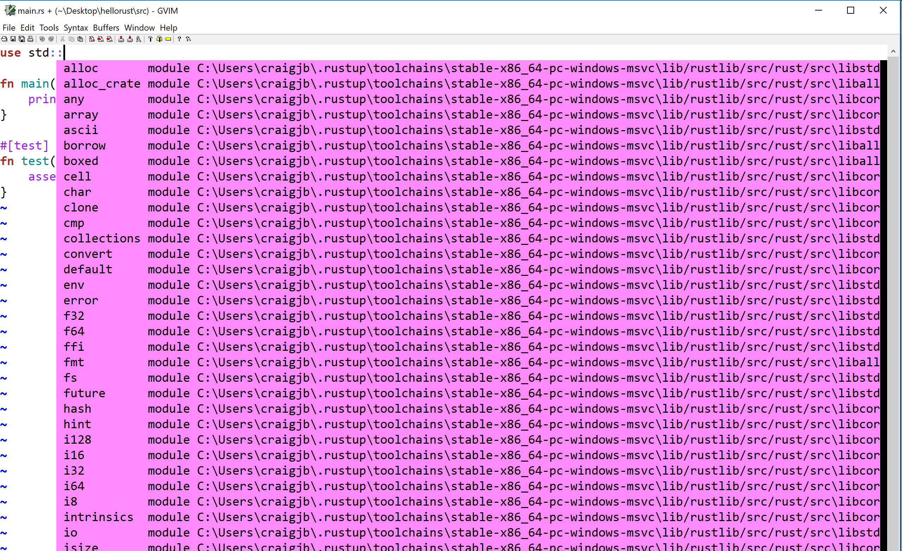

## Configuring VS Code for Rust with the RLS
The steps below configure VS Code on Windows to support Rust and use the Rust Language Server (RLS) for autocompletion and incremental compilation to display warnings and errors.

1. Install the Rust (rls) extension by user 'rust-lang' in VS Code. There are several other plugins, but this one is the most maintained.
2. Reload the window in VS Code, or restart VS Code
3. If you see an error message that the RLS could not be started or that the extension could not find rustup, then you will have to configure VS Code's path for rustup:
   1. Open VS Code preferences and navigate to the Rust extension preferences
   2. Modify the rustup path to use an absolute path to your installation: `C:\Users\<username>\.cargo\bin\rustup`

        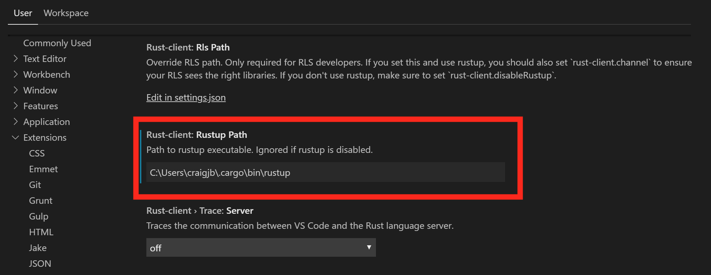

   3. Reload the window in VS Code, or restart VS Code
   4. You may see a prompt in the lower-right to install the RLS. If so, click yes.

4. Open a Rust file and test out the RLS:
   1. Try autocompletion (for example start typing `use std::`) at the top of a file
   2. Try the incremental compilation (for example `println!("Hello, world!") blah blah 42 42` should show an inline error)
   
    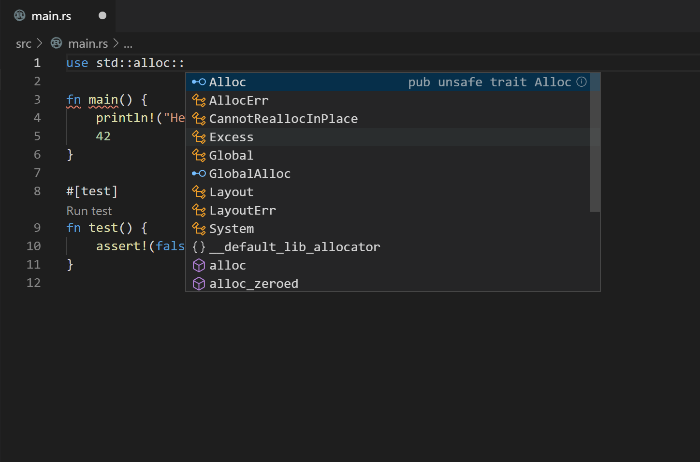

5.  Enable format on save in VScode settings. Code->Preferences->Settings->Text Editor->Formatting->Format On Save
