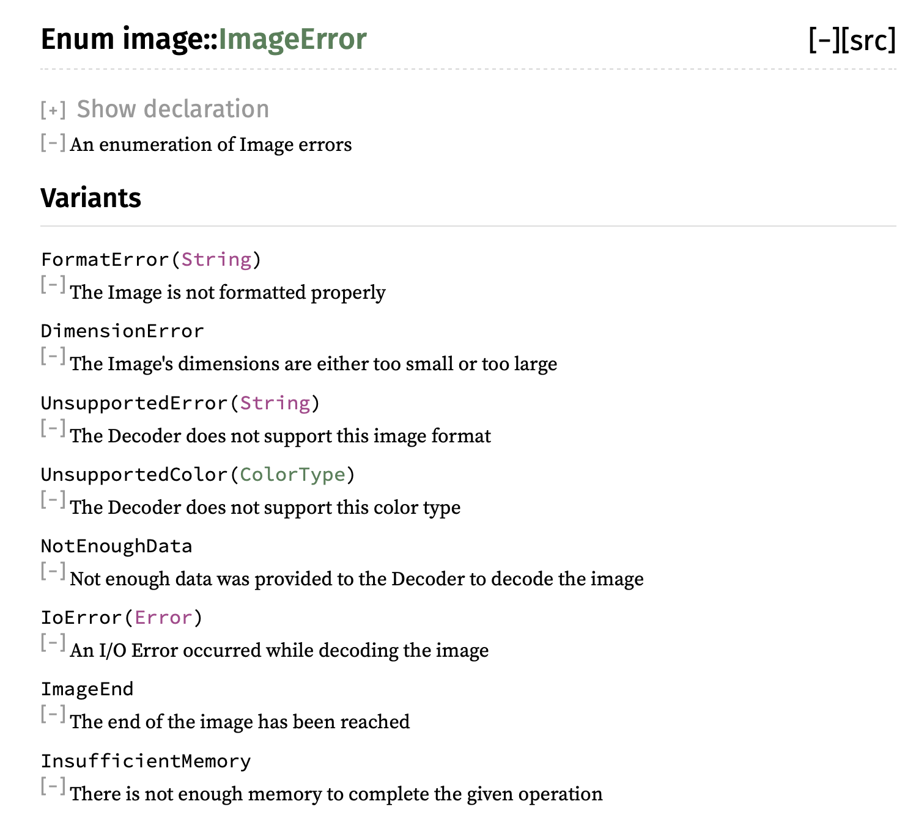
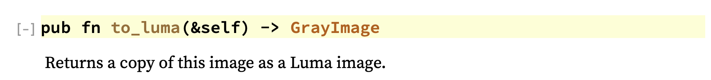
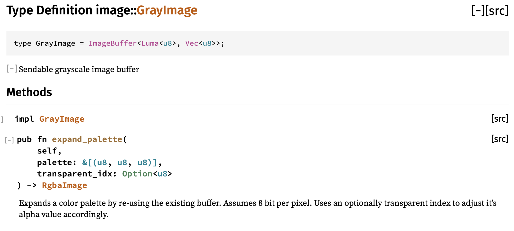

# Image Processing Example
It's time now; we're going to build a bigger example project.

For this example we're going to build a simple utility for applying the [Sobel operator](https://en.wikipedia.org/wiki/Sobel_operator) to an input image and outputting the image. What's the Sobel operator? It's one of several methods for highlighting edges in an image, and looks like this:


The Sobel operator is represented as a kernel that is convolved with an image to produce the output. [Convolving a kernel with an image](https://en.wikipedia.org/wiki/Kernel_(image_processing)#Convolution) is an incredibly common operation in all kinds of image processing.

In our Sobel example, we will use the kernels below, which calculate estimates of the gradient: Gx and Gy. In an image, the gradient describes how fast the color of the image is changing in a direction, X and Y in this case. Typically, edges change very quickly, so if we output the gradient of the image, we expect the edges to have high values.

In these equations, Gx and Gy are the gradients (how fast the color is changing) in the X and Y directions. The matrix is the kernel and A is the block of pixels we're convolving with the kernel.


That may sound complicated, but it boils down to this: multiply each pixel in the block (matrix A of pixel values) with the corresponding value in the kernel matrix, and then add up all the results.

To do this for a whole image, we slide the matrix A around so that the pixel we're processing is the center.

Let's get going!

## Input parameters
To specify the input and output image paths, we'll parse args from `std::env::args()` using the same method we explored earlier.

```rust,editable,ignore,mdbook-runnable
use std::env;

struct Opt {
    input_path: String,
    output_path: String,
}

fn options() -> Option<Opt> {
    Some(Opt {
        input_path: env::args().nth(1)?,
        output_path: env::args().nth(2)?,
    })
}

fn main() {
    let options = options().expect("Failed to parse command options!");
}
```

## Loading the input image
For now, let's just write the input to the output, passthrough, using the image create we looked at earlier.

```rust,ignore
let input_image = image::open(&options.input_path)
    .expect("Failed to open input image file");

input_image.save(&options.output_path)
    .expect("Failed to save output image to file");
```
## Converting to grayscale (or luma)
In order to apply our Sobel operator from above, we're going to need an image in grayscale, with one value per pixel. We also eventually need to the values to be floating-point, but first let's convert to grayscale. Converting an RGB image to grayscale requires specific weights per component, but luckily the image create already implements this for us. We just need to figure out how to use it. Let's take a look at the docs again.


### Quick look at custom error types and Result aliases

The `load` function returns an `ImageResult`. This is a custom Result enum in the image crate, which is just a shortcut for `Result<DynamicImage, ImageError>` where `ImageError` is another enum in the crate with all the possible errors.

This pattern is pretty typical for crates, both to encapsulate their possible errors in one enum and to create a type alias for Result to simplify declarations. If you click on `ImageError` in the docs, you can see the detailed definition of the possible errors.



If you want to handle errors in specific ways, you can use a match statement. You can even ignore some errors if you want and just panic, usually only if you're writing an app, not a library. If you're writing a library, you typically want to encapsulate errors and pass them back to the caller for handling.

```rust,ignore
# extern crate image; // once again, limitation of Rust playground

fn main() {
    let image = match image::open("filename.png") {
        Err(image::ImageError::UnsupportedError(s)) =>
            panic!("Try a different format: {}", s),
        Err(_) =>
            panic!("Failed to load image file!"),
        Ok(img) => img
    };
}
```

### to_luma() method
From looking at the [docs](https://docs.rs/image/0.22.1/image/enum.DynamicImage.html#method.to_luma) on `image::open` we now know that it returns a `DynamicImage` type. If we peek at the `DynamicImage` docs we'll find a function called `to_luma()`, which is exactly what we want. Notice it returns a different type, `GrayImage`.

Since types and abstractions in Rust don't incur overhead, it's pretty typically to use more types than less to represent different possible data structures and formats. This not only makes code clear to the reader, but also allows the compiler to help you enforce invariants.

For example, we can make our processing code later only accept `GrayImage` as input, which makes sure the caller has converted any inputs.



```rust,ignore
let input_image = image::open(&options.input_path)
    .expect("Failed to open input image file");

let gray_image = input_image.to_luma();

gray_image.save(&options.output_path)
    .expect("Failed to save output image to file");
```

The output image should now look like:


## Defining the kernels
We can define the kernels multiple ways, but for now let's use a fixed size array of fixed size arrays. This preserves the row and column structure of the kernels. We'll use the const keyword to define these as constant, static data outside of any function. The compiler will not let us in any way mutate this data.

```rust,ignore
/// Kernel for the Sobel operator in the X direction
const SOBEL_KERNEL_X: [[f32; 3]; 3] = [
    [-1.0, -2.0, -1.0],
    [0.0, 0.0, 0.0],
    [1.0, 2.0, 1.0]
];

/// Kernel for the Sobel operator in the Y direction
const SOBEL_KERNEL_Y: [[f32; 3]; 3] = [
    [-1.0, 0.0, 1.0],
    [-2.0, 0.0, 2.0],
    [-1.0, 0.0, 1.0]
];
```

## Convolution
As we explored above, the convolution operator for a kernel and a block of pixels boils down to a pretty simple series of operations. First we multiple each value from the kernel matrix with its corresponding value in the block of pixels, and then, we sum up all the products. 

Let's start with the function signature:

```rust,ignore
fn convolve(kernel: &[[f32; 3]; 3], pixels: &[[f32; 3]; 3]) -> f32 {

}
```

Notice that both the kernel and pixels are borrowed, not moved, since the kernel will be re-used for all pixels. At least while starting out in Rust, prefer borrowing to moving unless you have a good reason.

Now it's time to put some meat into the function. Here we use `zip` to combine two iterators into one iterator that yields tuple elements. Since kernel and pixels are nested arrays, `kernel.iter()` and `pixels.iter()` both give iterators over elements of type `[f32; 3]`. So, the tuple parameter `(kernel_col, input_col)` has type `([f32; 3], [f32; 3])`. Therefore in the closure, we iterate and zip once again, to yield elements of type `(f32, f32)` that we can multiply together. Finally we use the sum combinator to add all the products up.

```rust,ignore
fn convolve(kernel: &[[f32; 3]; 3], pixels: &[[f32; 3]; 3]) -> f32 {
    let accumulator: f32 = kernel
        .iter()
        .zip(pixels.iter())
        .flat_map(|(kernel_col, input_col)| {
            kernel_col
                .iter()
                .zip(input_col.iter())
                .map(|(k, p)| k * p)
        })
        .sum();
}
```

Let's write a quick sanity test for our convolution function. Typically, tests are separated into a "tests" module, but kept inline with the code they verify. So, in our main file we can create a module, and mark it so that it is only compiled in the test configuration. Any function marked with `#[test]` will be run as a test.
```rust,ignore
#[cfg(test)]
mod tests {
    use super::*;

    #[test]
    fn test_convolution() {

    }
}
```

```rust,ignore
#[cfg(test)]
mod tests {
    use super::*;

    #[test]
    fn test_convolution() {
        let pixels: [[f32; 3]; 3] = [
            [1.0, 2.0, 3.0],
            [4.0, 5.0, 6.0],
            [7.0, 8.0, 9.0]
        ];
        assert_eq!(convolve(&SOBEL_KERNEL_X, &pixels), 24.0);
        assert_eq!(convolve(&SOBEL_KERNEL_Y, &pixels), 8.0);
    }
}
```

Run the tests with `cargo test` and we should see passing tests.

## Getting the pixels
Our convolution function is ready, but we are missing the connection between the image we converted to luma and the convolution operator. Let's look into the [docs on GrayImage](https://docs.rs/image/0.22.1/image/type.GrayImage.html) to see how we can get pixel values out.



At first glance, it doesn't look like there are many methods, huh?

Let's take a closer look. `GrayImage` is defined as a type alias of a specific variation of ImageBuffer (using generic type parameters). If we click on `ImageBuffer` (usually in Rust docs, you can click on a type name to see its docs), we will see the [full list of available methods](https://docs.rs/image/0.22.1/image/struct.ImageBuffer.html).


There's a `get_pixel` method! Oh, but the return type is `&P`, that's weird. If we look at the declaration of ImageBuffer though, we see that `P` must implement the `Pixel` trait. And if we look at the `Pixel` [trait docs](), we see a method called `channels()` that gives us a slice of the pixel's values, one for each channel. Since out image is grayscale (luma), we expect just one channel.

This might seem over-complicated. However, by abstracting away the underlying storage formats, the "image" crate lets users build processing systems that are general over many image formats. Remember, the Rust compiler boils down all of the abstractions into highly optimized code. So we can have our generics and safety while writing high-performance code!

For our case, we just have a GrayImage with pixels of type `Luma<u8>` that implement the `Pixel` trait. So we should be able to fetch a pixel pretty easily. Here's a go:

```rust,ignore
use image::Pixel; // trait for '.channels()'

...

let input_image = image::open(&options.input_path)
    .expect("Failed to open input image file");

let gray_image = input_image.to_luma();

println!("Pixel 0, 0: {}", gray_image.get_pixel(0, 0).channels()[0]);

gray_image.save(&options.output_path)
    .expect("Failed to save output image to file");
```

Generally, well-written Rust crates provide comprehensive types like this to cover the data formats and structures that they operate on. An image library in C/C++ may provide a raw buffer of pixels, which is easy to access. But, as soon as you have to deal with multiple formats, multiple pixel orderings (RGB, BGR, RGBA, etc.), it can be difficult to ensure all code branches are correct. With Rust, the type system will catch these errors at compile time.

Now that we can grab pixels, let's write a function that takes the pixel values and calls our convolution function. First we'll start with this signature, and copying the input. We need a place to store the resulting convolved pixel values, and we want an image of the same dimensions and data types. `clone()` is an easy way to get that. Notice that `result` is declared as `mut` since we will be modifying its contents.

```rust,ignore
use image::GrayImage;

fn sobel_filter(input: &GrayImage) -> GrayImage {
    let mut result = input.clone();

    result
}
```

To start with, let's just create the block of pixels to feed the convolution for each center pixel.

```rust,ignore
fn sobel_filter(input: &GrayImage) -> GrayImage {
    let mut result = input.clone();

    for x in 0..input.width() {
        for y in 0..input.height() {
            let pixels = [
                [input.get_pixel(x - 1, y - 1).channels()[0],
                 input.get_pixel(x - 1, y).channels()[0],
                 input.get_pixel(x - 1, y + 1).channels()[0]],
                [input.get_pixel(x, y - 1).channels()[0],
                 input.get_pixel(x, y).channels()[0],
                 input.get_pixel(x, y + 1).channels()[0]],
                [input.get_pixel(x + 1, y - 1).channels()[0],
                 input.get_pixel(x + 1, y).channels()[0],
                 input.get_pixel(x + 1, y + 1).channels()[0]]];
        }
    }

    result
}
```

We'll need to throw a call into `fn main()` to use this:

```rust,ignore
let input_image = image::open(&options.input_path)
    .expect("Failed to open input image file");

let gray_image = input_image.to_luma();

let output_image = sobel_filter(&gray_image);

output_image.save(&options.output_path)
    .expect("Failed to save output image to file");
```

And then when we run this... what happened?!? What does it mean we attempted subtraction with overflow?

Well, in Rust debug builds, the primitive integer types are checked for overflows an underflows in the basic operations. Don't worry, these are not enabled in the release build unless you specifically want.

And, just like now, the overflow checks in debug builds help catch bugs early on.

## Handling the edges
The overflow is happening because of the `x - 1` and `y - 1` when x or y is zero. This is indicative of a bigger question: how should we handle the edges of the image?

As the [Wikipedia page on convolution kernels](https://en.wikipedia.org/wiki/Kernel_(image_processing)#Edge_Handling) explains, there are several ways:
- Extend the image by duplicating pixels at the edge
- Wrap around to the other side
- Crop the output image 2 pixels smaller in X and Y
- Crop the kernel on the edges and corners

If we crop the output image, we can easily adapt our code. The ImageBuffer struct implements the GenericImage trait which has a function called `sub_image` that gives us a view into rectangular section of an image. With a `SubImage` we can call `to_image()` to get a cropped `ImageBuffer` back out.

```rust,ignore
use image::GenericImage;

fn sobel_filter(input: &GrayImage) -> GrayImage {
    let mut result = input
        .sub_image(1, 1, input.width() - 2, input.height() - 2)
        .to_image();

    for x in 1..(input.width() - 1) {
        for y in 1..(input.height() - 1) {
            let pixels = [
                [input.get_pixel(x - 1, y - 1).channels()[0],
                 input.get_pixel(x - 1, y).channels()[0],
                 input.get_pixel(x - 1, y + 1).channels()[0]],
                [input.get_pixel(x, y - 1).channels()[0],
                 input.get_pixel(x, y).channels()[0],
                 input.get_pixel(x, y + 1).channels()[0]],
                [input.get_pixel(x + 1, y - 1).channels()[0],
                 input.get_pixel(x + 1, y).channels()[0],
                 input.get_pixel(x + 1, y + 1).channels()[0]]];
        }
    }

    result
}
```

Cool. No more overflows. We should get the convolution in there! Usually, we also divide by a constant value to "normalize" the result (really just make sure it is within the 0.0-1.0 range). For the Sobel operator on a 3x3 block of pixels, a divisor of 8.0 works well. Oh, and did you find a place where clone might be handy?

```rust,ignore
use image::GenericImage;

fn sobel_filter(input: &GrayImage) -> GrayImage {
    let mut result = input
        .clone()
        .sub_image(1, 1, input.width() - 2, input.height() - 2)
        .to_image();

    for x in 1..(input.width() - 1) {
        for y in 1..(input.height() - 1) {
            let pixels = [
                [input.get_pixel(x - 1, y - 1).channels()[0],
                 input.get_pixel(x - 1, y).channels()[0],
                 input.get_pixel(x - 1, y + 1).channels()[0]],
                [input.get_pixel(x, y - 1).channels()[0],
                 input.get_pixel(x, y).channels()[0],
                 input.get_pixel(x, y + 1).channels()[0]],
                [input.get_pixel(x + 1, y - 1).channels()[0],
                 input.get_pixel(x + 1, y).channels()[0],
                 input.get_pixel(x + 1, y + 1).channels()[0]]];

            let gradient_x = convolve(&SOBEL_KERNEL_X, &pixels) / 8.0;
            let gradient_y = convolve(&SOBEL_KERNEL_Y, &pixels) / 8.0;
        }
    }

    result
}
```

Uh oh. Now we have a different problem. Our `GrayImage` gives us `u8` from `get_pixel(x, y).channels()[0]`, but `convolve` expects the pixels to be f32. In fact, our convolution also expects the pixels to be in the range \[0.0-1.1\].

## LumaFloat trait
This is a great time to build a new trait! We can create a trait with a new `get_float_luma()` function and implement it for GrayImage. Since we're also going to be writing pixels to the output image, let's also add a `put_float_luma()` method.

```rust,ignore
trait LumaFloat {
    fn get_float_luma(&self, x: u32, y: u32) -> f32;
    fn put_float_luma(&mut self, x: u32, y: u32, luma: f32);
}

impl LumaFloat for GrayImage {
    fn get_float_luma(&self, x: u32, y: u32) -> f32 {
        self.get_pixel(x, y)[0] as f32 / 255.0
    }

    fn put_float_luma(&mut self, x: u32, y: u32, luma: f32) {
        self.put_pixel(x, y, Luma([(luma * 255.0) as u8]));
    }
}
```

Now in our Sobel filter function, things get a lot cleaner. We can also add a couple lines to compute the magnitude of the gradient and store it back to the resulting image.

```rust,ignore
use image::{GenericImage, GrayImage, Luma};

fn sobel_filter(input: &GrayImage) -> GrayImage {
    let mut result = input
        .clone()
        .sub_image(1, 1, input.width() - 2, input.height() - 2)
        .to_image();

    for x in 1..(input.width() - 1) {
        for y in 1..input.height() - 1 {
            let pixels = [
                [input.get_float_luma(x - 1, y - 1),
                 input.get_float_luma(x - 1, y),
                 input.get_float_luma(x - 1, y + 1)],
                [input.get_float_luma(x, y - 1),
                 input.get_float_luma(x, y),
                 input.get_float_luma(x, y + 1)],
                [input.get_float_luma(x + 1, y - 1),
                 input.get_float_luma(x + 1, y),
                 input.get_float_luma(x + 1, y + 1)]];

            let gradient_x = convolve(&SOBEL_KERNEL_X, &pixels) / 8.0;
            let gradient_y = convolve(&SOBEL_KERNEL_Y, &pixels) / 8.0;
            let magnitude = (gradient_x.powi(2) + gradient_y.powi(2)).sqrt();
            result.put_float_luma(x - 1, y - 1, magnitude);
        }
    }

    result
}
```

Now if we `cargo run`, the output should be interesting. If the runtime is a bit long, you might try `cargo run --release`. Running in release mode can make a massive difference.

## We have a Sobel Filter!


## Extra credit
- Can you implement edge extension instead of cropping?
- Can you implement a box blur instead of the Sobel operator?
- Can you extend the command line interface to allow the user to select what filter to apply?