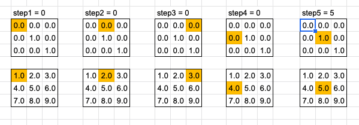

# Testing

[Convolving a kernel with an image](https://en.wikipedia.org/wiki/Kernel_(image_processing)) is an incredibly common operation in all kinds of image processing. With it we can implement all the machine learning greatest hits, which for images as you can see includes [edge detection sharpen, blur and more](https://en.wikipedia.org/wiki/Kernel_(image_processing)#Details). Convolution should remind you of Convolution Neural nets and might give you an idea how those work too.

To convolve, we multiply each element in the data (lets say pixels) with the corresponding value in the kernel matrix and then add up all the results.


Lets do a little test driven development in order to show off Rust's built in testing capability. So we need 2 sets of data, a kernel to convolve on our data, and some data (lets think of it as pixels). These kernels have been developed over the years in papers and are largely just avialable to copy. Did you notice the Identity Kernel on the page? That kernel, when convolved on data, simply returns back the original data unchanged. That would be an easy test to write.

We can define the data in many structures including Vecs, Arrays, or a math library might offer a Matrix type of some kind. Looking at the identity kernel we need a 3x3 set of floats. For now let's use a fixed size array of fixed size arrays. This preserves the row and column structure of the kernels. We'll use the const keyword to define these as constant, static data outside of any function. The compiler will not let us in any way mutate this data.

```rust,ignore
const IDENTITY: [[f32; 3]; 3] = [
    [0.0, 0.0, 0.0],
    [0.0, 1.0, 0.0],
    [0.0, 0.0, 0.0]
];
```

Now we need some test data to convolve with our identity. When we convolve we're looking at the value of interest, generally the center value, but we also take with it some amount of its nearby values in order to let those effect the value we care about. This is the value were 'convolving' around. Lets just make up a fake set of pixels, 1.0 through 9.0 where the value of interest is thus 5.0 

```rust,ignore
let pixels: [[f32; 3]; 3] = [
    [1.0, 2.0, 3.0],
    [4.0, 5.0, 6.0],
    [7.0, 8.0, 9.0]
];
```

We need a convolve function that takes the kernel we want to convolve around the data. We could jump in and try and write the whole thing but lets procrastinate a bit more. We need our function to have 2 arguments, the kernel and the pixel data, and we probably don't want to consume them as we might want to use them in another function so lets take borrows of those as our arguments. Further if we run the convolve steps we previously discussed above by hand, you'd expect the identity, which doesnt change our value of interest, to just return the value in this case 5.0 so let's hardcode that.

```rust, ignore
fn convolve(kernel: &[[f32; 3]; 3], pixels: &[[f32; 3]; 3]) -> f32 {
    5.0
}
```

Now we can write a test to assert that running `convolve` indeed does return 5.0;

```rust,ignore
#[cfg(test)]
mod tests {
    use super::*;

    #[test]
    fn test_convolution_identity() {
        let pixels: [[f32; 3]; 3] = [
            [1.0, 2.0, 3.0],
            [4.0, 5.0, 6.0],
            [7.0, 8.0, 9.0]
        ];
        assert_eq!(convolve(&IDENTITY, &pixels), 5.0);
    }
}
```

We can run this test with `cargo test` and we should see passing tests!

We'll come back to implmenting our convolve function for real in a second, but we'll need a few more tools in our toolbox so first we learn how to iterate over these arrays and multiply them using iterators.
