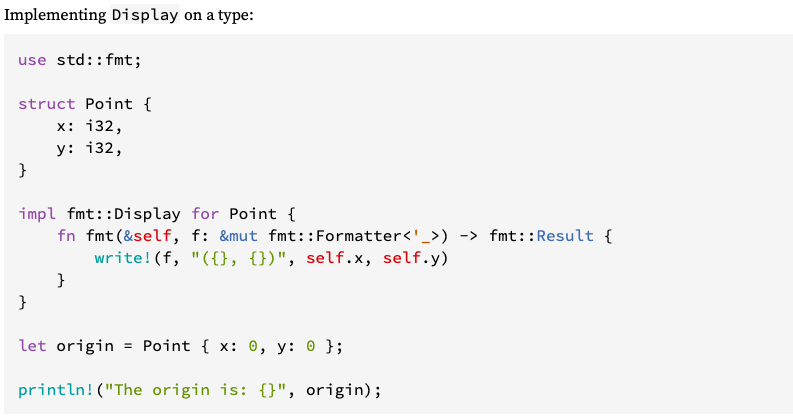

# traits

But hey this seems wordy, lets just print our whole struct in one formatter.
```rust,ignore,no_run
//println!(
//    "input_path:{} output_path:{}",
//    options.input_path, options.output_path
//);
println!("{}", options);
```

Running this results in:
```text
error[E0277]: `Opt` doesn't implement `std::fmt::Display`
  --> src/main.rs:14:20
   |
14 |     println!("{}", options);
   |                    ^^^^^^^ `Opt` cannot be formatted with the default formatter
   |
   = help: the trait `std::fmt::Display` is not implemented for `Opt`
   = note: in format strings you may be able to use `{:?}` (or {:#?} for pretty-print) instead
   = note: required by `std::fmt::Display::fmt`

error: aborting due to previous error

For more information about this error, try `rustc --explain E0277`.
error: Could not compile `training`.

To learn more, run the command again with --verbose.
```

Thats actually really rather helpful error with a several ideas for fixing it. AND in this case if say you're offline and can't google for more information it even has another page or two of content if you run the `rustc --explain E0277` command it mentions! 

> The compiler in Rust is almost always, really, actually, trying to tell you whats wrong, AND how to fix it. And if you find a case where it is not the Rust community would likely want to know how to make that error and the resulting action you should take more clear. 

For this exercise we choose to manually implement the Display trait.

In Rust we stress composition over inheritance using [traits](https://doc.rust-lang.org/book/ch10-02-traits.html). Traits, much like header files, separate the definition from the implementation. Before we solve our actual Display problem by consuming someone else’s trait definition, lets make a convoluted example to illustrate the syntax. We'll make a silly trait that has one function so that `println!` SHOUTS our filenames.
```rust,ignore,no_run
// create the new trait which has one function, shout
pub trait Shout {
    // we automatically get passed whatever variable function is called
    // on as the first argument to the function, we generally call it self
    fn shout(self);
}

// now implement the new trait you made
// since we're impl for Opt, self is an Opt and we have access to
// input_path and output_path
impl Shout for Opt {
    fn shout(self) {
        println!(
            "{} {}",
            self.input_path.to_uppercase(),
            self.output_path.to_uppercase()
        );
    }
}
```

Now anytime this trait is in namespace, which in our case it is because it defined in this same file, it is available on all instances of Opt. Lets call it:
```rust,ignore,no_run
//println!("{}", options);
options.shout();
```
and well should see something like
```text
CAT.JPG OUT.PNG
```
> The separation of definition from implementation is incredibly powerful. This way if we make our trait public anyone downstream can customize our function for their architecture or edge case. This keeps Rust from amongst other things passing around huge config structs full of lifecycle callbacks and other configuration overrides.

Back to our real problem. As a reminder rustc said
```text
   = help: the trait `std::fmt::Display` is not implemented for `Opt`
```
Looking in the std documentation we find [Display](https://doc.rust-lang.org/std/fmt/trait.Display.html) which shows us an example like below.


Recall when we implement traits, the function definition was set in stone by the trait.  (Note: We're still punting on the & and &mut until the borrowing chapter, but it doesn't matter here as the function definition is set in stone by the trait)
In this case they pass us self (whatever type this method was called on, in this case Point, in our case Opt) and a second arg name f which well use the write! (just like `println!` except it sticks the output in its first argument) to print into.

We're only responsible for the implementation of the method. In the case of this Display trait that freedom largely pertains to which arguments and how we would like to insert them into the format string.

EXERCISE: Implement `fmt::Display` for `Opt` just like the example above did for Point so that this runs successfully
```rust,ignore,no_run
println!("{}", options);
```

And with that you've:
 - created a new type and defined and implemented traits for it
 - implemented a trait you didn’t own.
 - but there's a third case you'll come across which is wanting to implement a trait you don't own on a type you don't own. 

> For various reasons, the compiler can't reason about these 'orphan rules' and doesn't allow them.  There are many ways around the limitation including forking the underlying crate and [overriding dependencies](https://doc.rust-lang.org/cargo/reference/specifying-dependencies.html#overriding-dependencies) with Cargo patch functionality as well as the newtype pattern.
